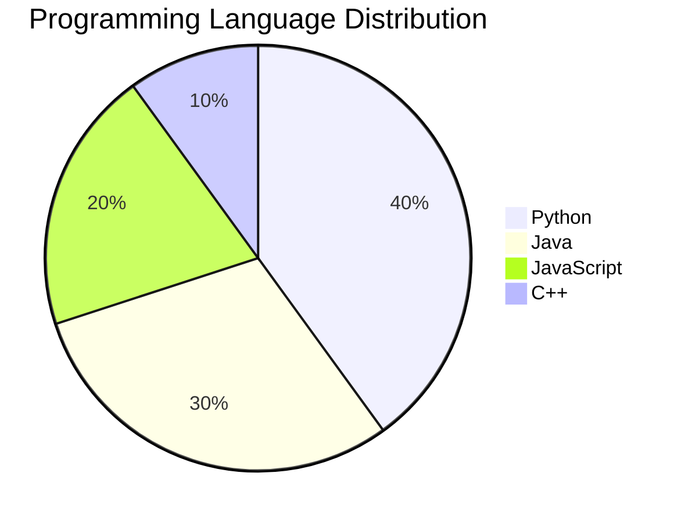
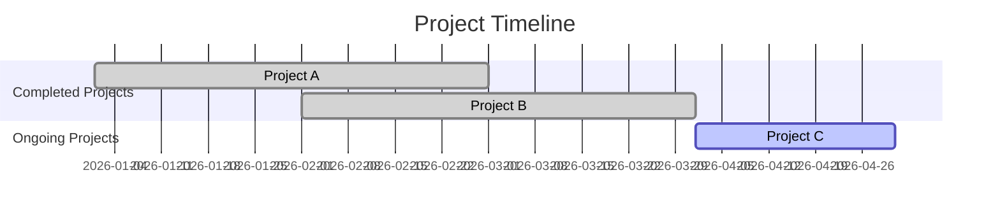

# Welcome to the MANI8148 Repository!

### Overview
This repository is a showcase of the skills and projects of a Year 2 BTech IT student at IIITA. Here, you will find advanced visualizations and insights into various facets of my academic journey.

---

## Technology Maps

Visual representation of technologies I have explored and utilized over the past year.

---

## Language Distribution

A breakdown of programming languages I frequently use in my projects.

---

## Project Timeline

An overview of projects completed and ongoing, showcasing progress and future plans.

---

## Skill Matrix
| Skills         | Proficiency |
|----------------|-------------|
| Python         | ★★★★☆      |
| Java           | ★★★☆☆      |
| JavaScript     | ★★★★☆      |
| C++            | ★★☆☆☆      |
| Data Science    | ★★★★☆      |
| Web Development | ★★★☆☆      |

A self-assessment of skills I have developed during my coursework and projects.

---

## Contribution Metrics

Detailed insights into my contributions in open source projects (stubs for actual graphs).

---

## Interactive Elements
Check out these interactive resources:
- [My Portfolio](https://example.com) 
- [Interactive Coding Challenges](https://example.com) 

### Fun Fact
Did you know that the first computer programmer was Ada Lovelace?

Feel free to explore and interact with the repository! 😊