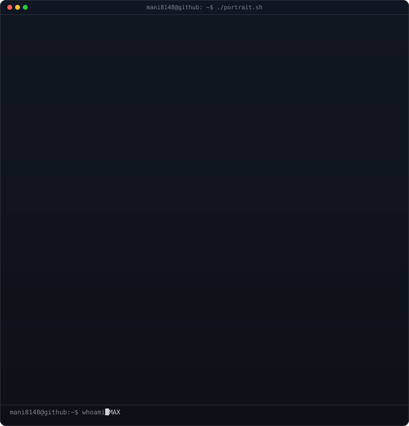
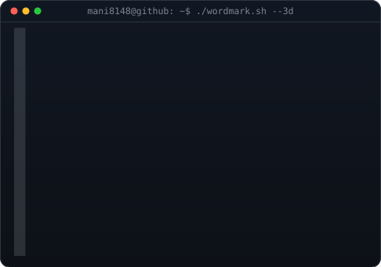
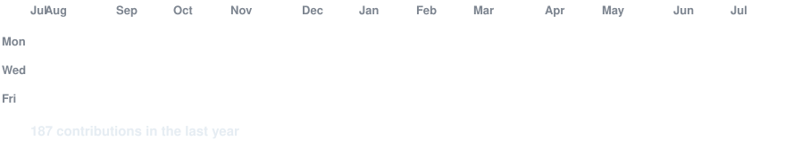

<!-- hero: monochrome ASCII portrait (types in) beside the extruded 3d ascii
     wordmark (scrambles in left-to-right, then loops forever).
     portrait: python scripts/prep_photo.py <photo> && python scripts/make_ascii_svg.py
     wordmark: python scripts/make_wordmark_svg.py --mode shuffle -->

<h3><code>mani8148@github ~ $ whoami</code></h3>

<table>
<tr>
<td valign="top"></td>
<td valign="top"></td>
</tr>
</table>

 
 

<!-- animated contribution graph: real data, boxes reveal cell by cell
     (regenerated daily by .github/workflows/update-profile-art.yml) -->

<h3><code>mani8148@github ~ $ ./contributions.sh</code></h3>

 
 

<h3><code>mani8148@github ~ $ ./stack.sh</code></h3>

<b>Fullstack Developer · AI · Competitive Programmer</b>

 

<!-- ===== GITHUB STATS ===== -->

 

<!-- Streak — full width -->
<picture>
  <source media="(prefers-color-scheme: dark)" srcset="https://streak-stats.demolab.com/?user=MANI8148&hide_border=true&background=0A101F&stroke=22D3EE&ring=A78BFA&fire=10B981&currStreakLabel=22D3EE&sideLabels=94A3B8&currStreakNum=F8FAFC&sideNums=F8FAFC&dates=64748B&titleColor=22D3EE&card_width=1180" />
  
</picture>

 

<!-- Stats + Top languages — side by side -->
<picture>
  <source media="(prefers-color-scheme: dark)" srcset="https://github-readme-stats.vercel.app/api?username=MANI8148&show_icons=true&count_private=true&include_all_commits=true&hide_rank=true&hide_border=true&title_color=22D3EE&icon_color=A78BFA&text_color=94A3B8&bg_color=0A101F&card_width=500" />
  
</picture>
<picture>
  <source media="(prefers-color-scheme: dark)" srcset="https://github-readme-stats.vercel.app/api/top-langs/?username=MANI8148&layout=compact&langs_count=8&hide_border=true&title_color=22D3EE&text_color=94A3B8&bg_color=0A101F&card_width=500" />
  
</picture>

<!-- ===== CONTRIBUTION SNAKE ===== -->

 

<picture>
  <source media="(prefers-color-scheme: dark)" srcset="https://raw.githubusercontent.com/MANI8148/MANI8148/output/snake-dark.svg" />
  <source media="(prefers-color-scheme: light)" srcset="https://raw.githubusercontent.com/MANI8148/MANI8148/output/snake-light.svg" />
  
</picture>

<!-- ===== END SNAKE ===== -->
 
 

<!-- ===== SOCIAL BADGES ===== -->
 

<!-- ===== END SOCIAL BADGES ===== -->

